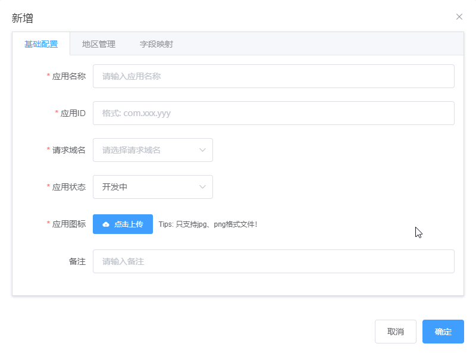
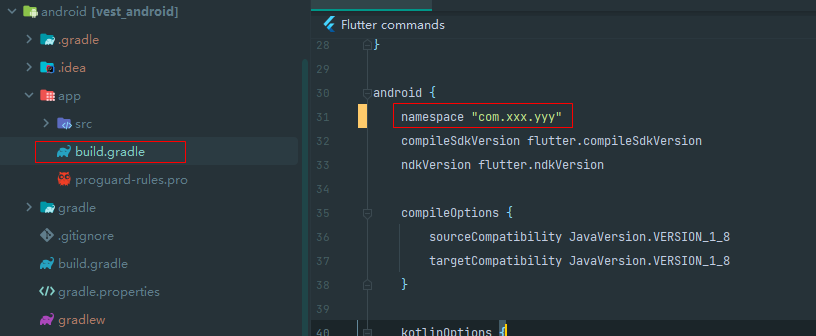
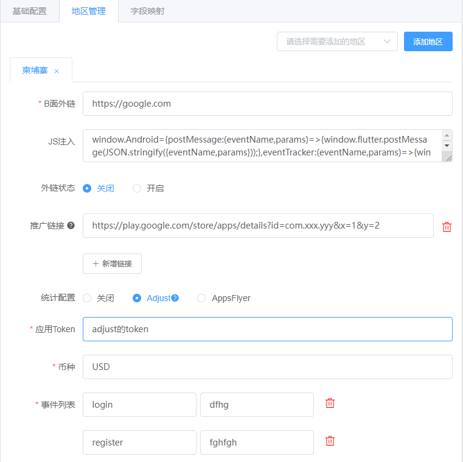
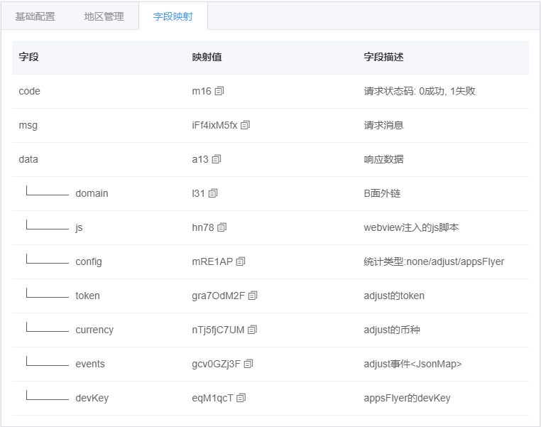

# 四、App管理
### 基础配置

> 应用ID正确填写安卓包Id

### 地区管理

| 字段             | 描述                | 说明                    |
|----------------|-------------------|-----------------------|
| B面外链           | -                 | 必须，找广告投放人员索取          |
| JS注入           | 需要注入b面的js脚本       | 可选，为了适配部分事件           |
| 外链状态           | 是否开启b面            | App是 ***审核中*** 状态关闭此项 |
| 推广链接           | 广告平台推广链接          | 主要是为了识别安装来源，找广告投放人员索取 |
| 统计配置           | 统计平台              | -                     |
| -----adjust    | -                 | -                     |
| ----------应用token        | adjust应用token     | -                     |
| ----------币种             | adjust应用币种        | -                     |
| ----------事件列表           | adjust自定义事件列表     | -                     |
| -----appsFlyer | -                 | -                     |
| ----------devKey         | appsFlyer应用devKey | -                     |

### 字段映射

