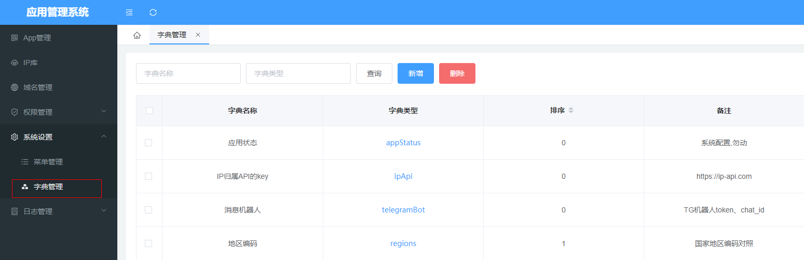
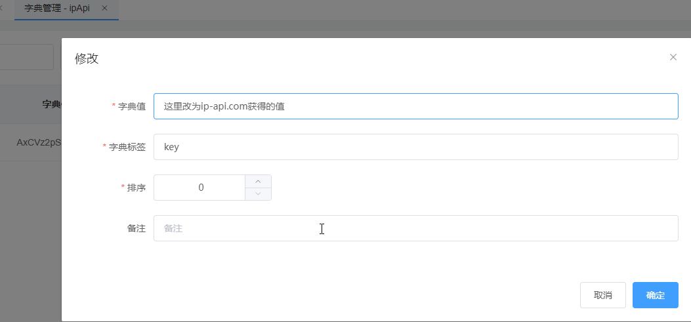
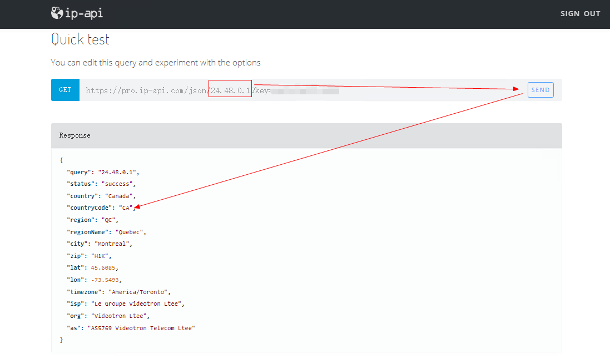

# 一、基础配置

### IP归属API的key
点击ipApi选项，跳转字典值页面，编辑字典标签为key的选项，修改字典值为 https://ip-api.com 获取到的key
> ps：字典标签字段不要修改

### 消息机器人
点击telegramBot选项，跳转字典值页面，分别编辑字典标签为token和chat_id的选项，修改字典值为响应的内容即可
> ps：字典标签字段不要修改

### 地区编码
点击regions选项，跳转字典值页面，添加马甲包上架的区域，字段值为地区countryCode，字典标签为显示的label
> 获取地区code可以通过 https:ip-api.com的后台服务实现，链接如下
> https://members.ip-api.com/docs/json   24.48.0.1 替换为目标地区ip即可获取countryCode

  