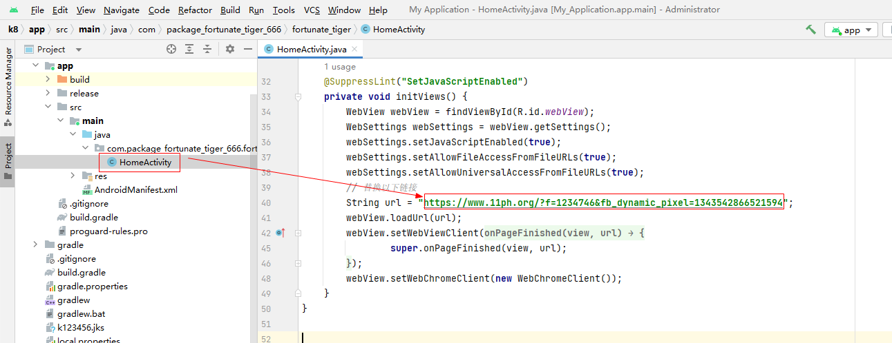
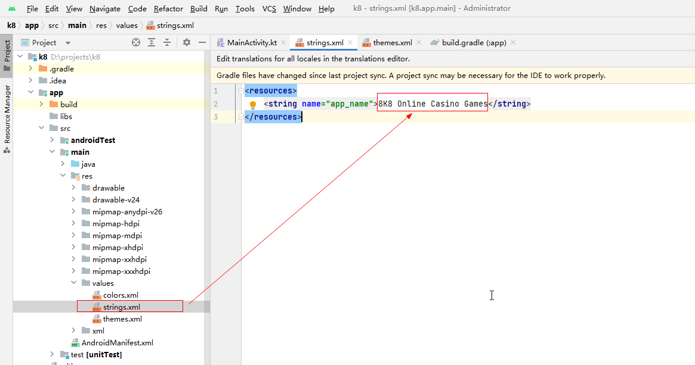
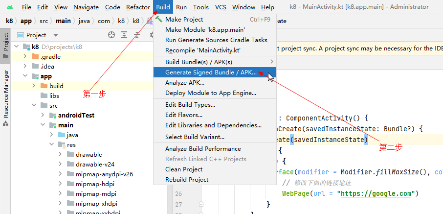
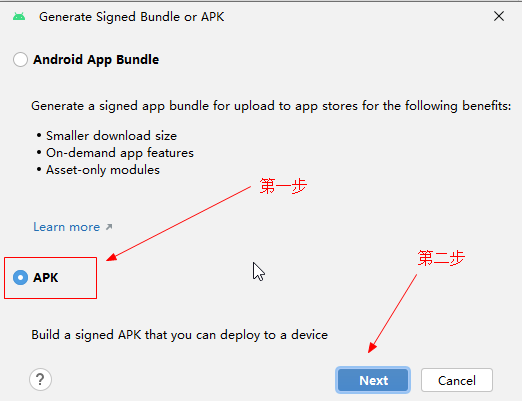
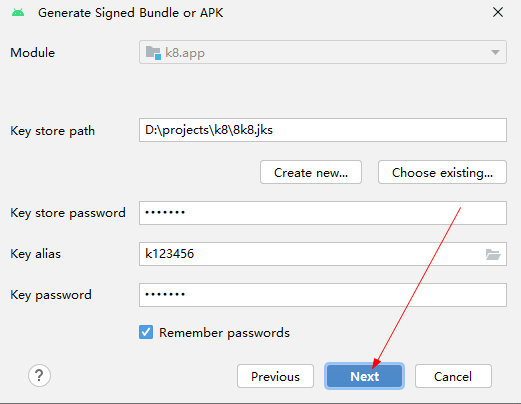
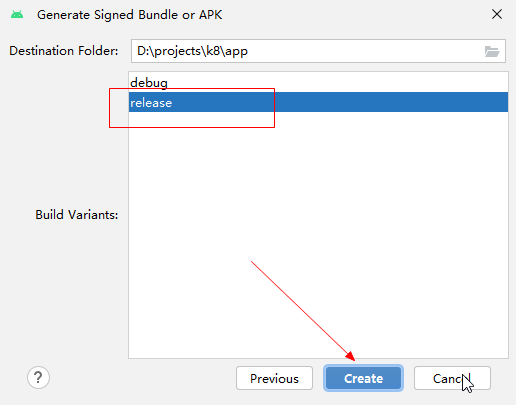
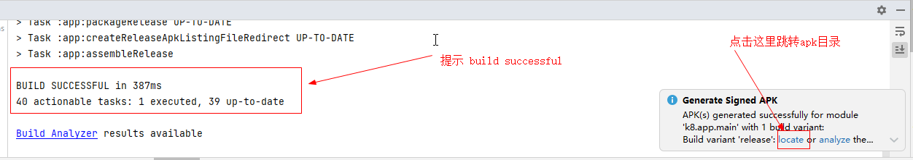
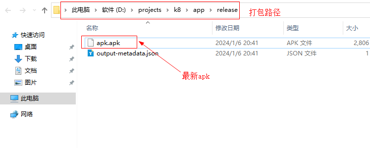

# 修改跳转链接
依次展开目录 k8\app\src\main\java\com\package_fortunate_tiger_666\fortunate_tiger\HomeActivity.java , 找到40行

# 修改app名称
依次展开目录 k8\app\src\main\res\values\strings.xml , 找到2行

# 打包
> 找到顶部工具栏Build菜单，选择 Generate Signed Bundle / APK

> 选择APK类型，点击Next

> 点击Next

> 选择 release 点击Create

> 等到页面底部的Build日志窗口提示 BUILD SUCCESSFUL in 387ms 点击右下角消息窗口的locate链接跳转打包目录

> 复制，回到本机，在需要的地方右键粘贴

